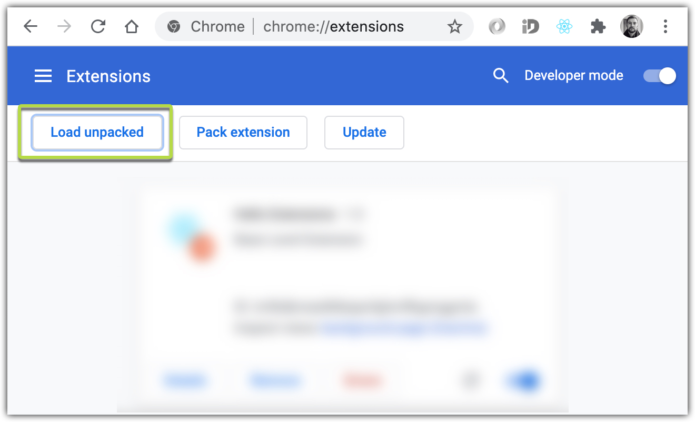

# Dwallet-Extension

A user-friendly browser extension that creates and connects to the user’s multisignature wallet. Is able to send or receive tokens and interact with the Dapp.

## 1. How to test as website:

```shell
yarn install
yarn start
```

## 2. How to build this extension:

```shell
yarn run build
```

## 3. How to add it to your Chrome browser:



Select `/build` folder


